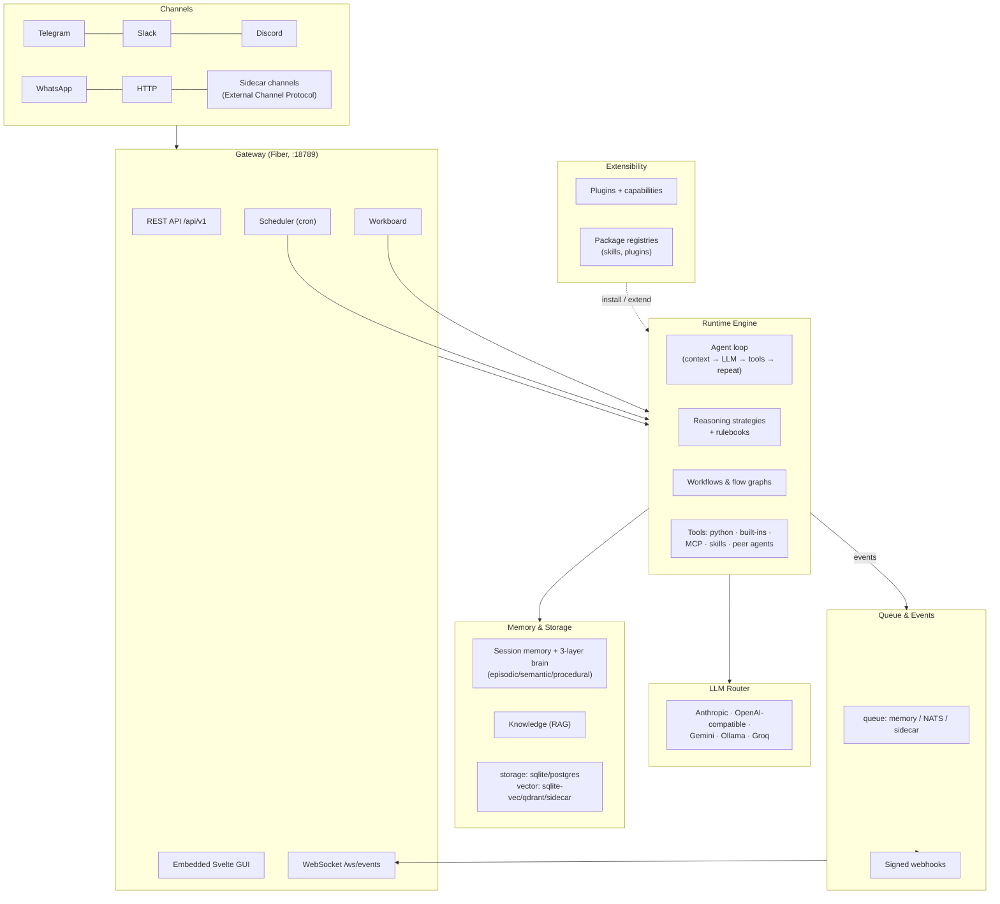

# Architecture Overview

Soulacy is a single Go binary: the gateway, the agent engine, the web GUI,
and every backend driver compile into one process. Channels, storage, and
voice can additionally run as supervised **sidecar processes**, so the
core binary stays static while the edges stay flexible.

## The big picture

## Components

**Gateway + GUI** — the only externally visible surface. A Fiber HTTP
server owns the [REST API](../api/index.md), CORS, rate limiting, auth
(static key → JWT → OIDC), the WebSocket event stream, and the embedded
Svelte GUI served from the same port. It contains no agent logic — it is
a thin adapter over the engine, loader, scheduler, and channels.

**Channels** — each adapter implements a small interface
(`Start`/`Send`/`Stop`/`Status`): Telegram (long-poll), Slack (Socket
Mode), Discord (gateway WebSocket), WhatsApp (Meta Cloud webhook with
HMAC verification), and the always-on HTTP channel behind `POST /chat`.
Out-of-process channels (e.g. WhatsApp Web, voice bridges) run as
supervised stdio **sidecars** speaking the
[External Channel Protocol](../EXTERNAL_CHANNEL_PROTOCOL.md), with crash
backoff and restart contained by the supervisor.

**Runtime engine** — the heart. For each inbound message it builds
context (memory + knowledge + skills catalog), assembles the per-agent
tool list, calls the LLM, executes tool calls, and repeats up to
`max_turns`. It is reentrant: a peer agent invoked as a tool is just
another engine call on a fresh, depth-limited session. SOUL.yaml files
hot-reload via a file watcher.

**LLM router** — a neutral `CompletionRequest` dispatched to the
configured provider: Anthropic, Gemini, Ollama, or any OpenAI-compatible
endpoint (OpenAI, Groq, OpenRouter, vLLM…). Embedders are registered
separately so each knowledge base can pin its own embedding
provider/model. See [LLM Providers](../configuration/llm.md).

**Memory layers** — session history (hot, capped by
`memory.max_history`), a durable SQLite archive, and the three-layer
*brain memory* (episodic / semantic / procedural) exposed via the
brain-memory API. Procedural memory is versioned as
[rulebooks](../RULEBOOKS.md) with history, rollback, and locking.
Semantic search runs on the configured
[vector backend](../configuration/storage.md).

**Queue & events** — every notable action becomes a schema-v1 envelope on
`soulacy.events.<type>`, carried by the configured queue (in-process by
default, NATS JetStream for multi-process). The same stream feeds the
GUI's WebSocket, [signed webhooks](../configuration/events.md), and any
external subscriber. Contract: [`docs/EVENTS.md`](../EVENTS.md).

**Plugins & capabilities** — plugins ship a signed
[manifest](../PLUGIN_MANIFEST.md) declaring the
[capabilities](../PLUGIN_CAPABILITIES.md) they need (events, credentials,
GUI mounts…). Installation is stage → safety introspection → explicit
approval ([`PLUGIN_INSTALL.md`](../PLUGIN_INSTALL.md)); a failing plugin
is skipped with a diagnostic, never a crash. Plugin GUIs mount as
sandboxed iframes with scoped tokens.

**Registries** — skills and plugins resolve by slug through configured
[package registries](../PACKAGE_REGISTRIES.md) (HTTP or git), queried in
priority order with optional ed25519 package signing. The reference
registry server ships in the binary (`soulacy registry serve`).

**Reasoning** — agents can opt into
[reasoning strategies](../REASONING_STRATEGIES.md) (plan-act loops and
friends) that emit `reasoning.start/step/result` events and can update
the agent's rulebook (`rulebook.updated`).

**Workflows & flows** — multi-step agent pipelines: declarative workflow
steps in SOUL.yaml and [flow graphs](../FLOW_GRAPHS.md) rendered live in
the GUI's Flow View.

## Request lifecycle (HTTP chat)

1. `POST /api/v1/chat` hits auth → RBAC → rate-limit middleware.
2. The HTTP channel hands the message to the engine synchronously.
3. The engine assembles context, loops LLM ↔ tools, persists memory.
4. Every step emits events: action log (durable JSONL + SQLite), the
   WebSocket hub, and the queue publisher (webhooks, NATS).
5. The reply returns in the HTTP response; costs are recorded per
   agent/session.

Scheduler triggers and Workboard runs enter at step 2 with synthetic
messages — same path, same observability.

## Where to go deeper

- [Specs & Deep Dives](specs.md) — annotated index of every in-repo spec
- [Configuration overview](../configuration/index.md) — every knob
- [API Reference](../api/index.md) — the full route catalog
- [`docs/FRAMEWORK_OVERVIEW.md`](../FRAMEWORK_OVERVIEW.md) — code-level
  walkthrough with file/line cite points
