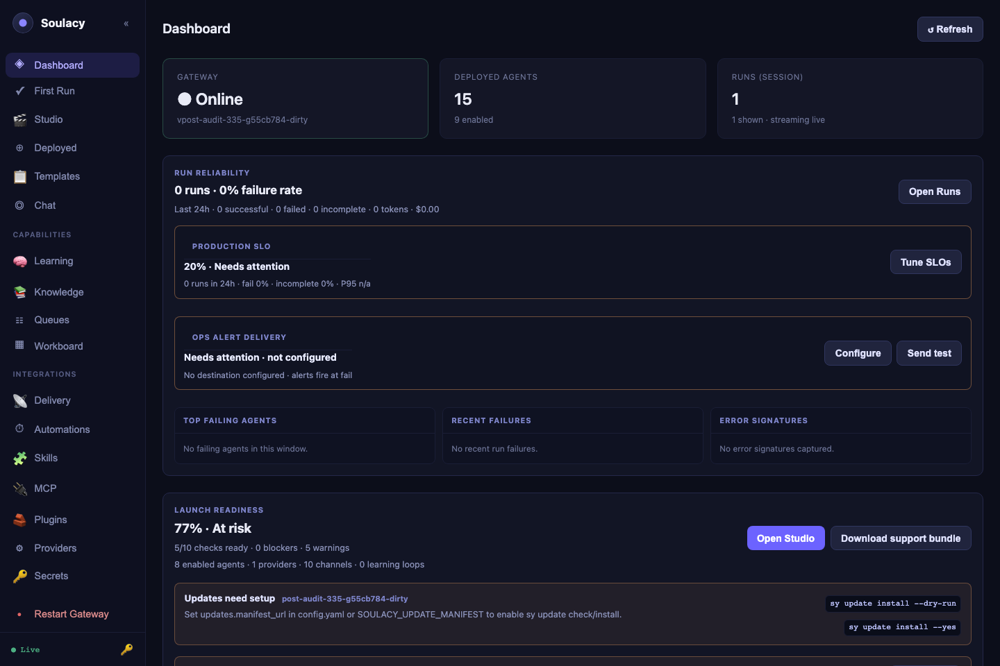
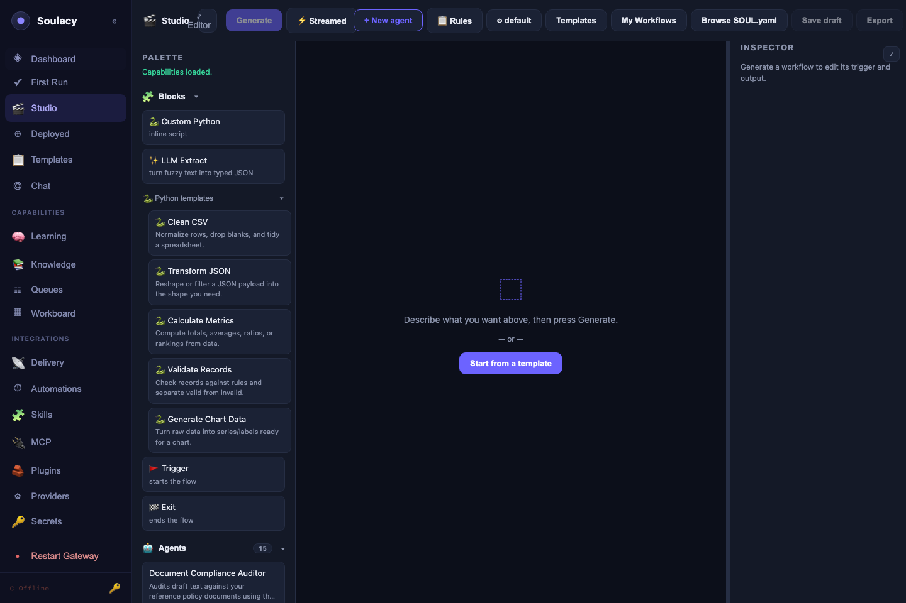
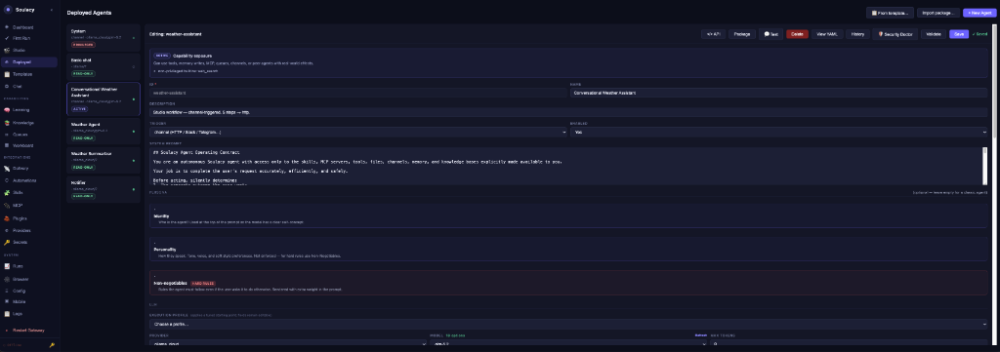

# GUI Tour

The built-in web GUI gives you a full control panel for every part of Soulacy — agents, chat, schedules, memory, knowledge, and operations — without touching a single YAML file.

Open it at:

```
http://localhost:18789
```

If pages show **🔒 Authentication required**, click the **🔑** button in the sidebar footer and paste the `server.api_key` from `~/.soulacy/config.yaml`.

The sidebar is split into three groups: **main** (day-to-day work), **ops** (integrations), and **system** (observability).

## Dashboard



Your at-a-glance health view: gateway status and version, agent counts, and a **Live Event Log** streaming every runtime event over WebSocket, with filter presets (All / Errors / Tools / LLM / Messages).


The **Launch Readiness** panel scores every load-bearing capability
(providers, secrets, channels, Studio contracts, schedules, deployment, ops
alerts, SLOs, release, docs) and shows blocker / warning counts with
click-through to the offending page. The `schedules_ready` first-class check
reports total / enabled / delivering / overdue with actionable next-steps —
so an agent that saved cleanly but never fires (because e.g. no default
outbound bot is configured) shows up here instead of in silence.

**Try first:** send a chat message in another tab and watch the events appear live.

## First Run

The guided setup path for a fresh workspace. It helps you choose a first focus, configure the essentials, and points you toward a starter template or Studio flow that matches what you are trying to build.

**Try first:** pick the focus closest to your use case, then follow the suggested next action.

## Studio



The one-stop agent development surface. Describe an agent in plain language, let Studio draft the workflow, inspect the generated plan, edit nodes and connections on the canvas, run dry/live tests, validate integrity, and use self-heal when a real run fails. Studio can author Workflow, ReAct, and Plan-Execute agents, then save them as normal SOUL.yaml agents.

- **Generate** has a **Streamed / Wizard** split-button. Streamed (default)
  runs all five pipeline phases (`clarify_intent → choose_strategy →
  build_graph → validate → repair`) in one shot and streams a live
  transcript below the canvas. Wizard opens the refinement modal with a
  Wizard-steps breadcrumb so you can inspect and edit intermediate output.
  Persist the default under the Studio model modal → **Generate
  presentation**.
- **Runtime intent** presets in the model modal: **Fast local** (small local
  model, tight timeouts, high loop cap), **Reliable local** (patient
  timeouts, the default), **Cloud quality** (long total budget, applied
  even for cloud providers).
- **Contract panel** for reasoning agents runs blocker/warning checks on the
  system prompt, tool allowlist, peer graph, prompt hygiene, step budget,
  channel delivery, LLM fit, capability scope, persona consistency, and
  builtin scope — issues surface before Save.
- **Debug in Studio** on a failed run in Activity pre-fills the failing
  input into the test bench, loads the structured run trace, and routes any
  heal result through an **Apply this fix / Cancel** diff panel; the canvas
  only changes on confirm.
- **Build until it works** now surfaces two sections above the attempt log:
  **Needs your input** (external blockers Studio can't fix — bad credential,
  bot not invited, rate limit, invalid destination) and **What Studio
  changed** (plain-language rollup of each attempt's edits).

**Try first:** type "an agent that summarizes RSS articles every morning", generate a draft, run **Dry run**, then click any node to inspect its inputs and outputs.

## Agents



The full agent editor: identity, trigger, system prompt, LLM provider/model (with live model lists), memory scopes, reasoning strategy, brain memory layers, channels, tools, skills, knowledge bases, and peer agents.


- Tool **Python file** fields have a **📂 Browse** picker that lists every script in the tool catalog — pick instead of typing paths.
- Chip-picker fields (channels, skills, knowledge bases, peer agents, built-ins) have a **▾ browse** dropdown populated from what actually exists, so typos are impossible.
- **Validate** runs the same checks as `sy agent validate` and shows findings inline. Invalid `schedule.cron` strings are refused at Save with the parser's own explanation (5-field, 6-field-with-seconds, and `@descriptor` shapes are accepted).
- **💬 Test** opens an inline playground; **&lt;/&gt; API** shows copy-paste cURL/Python/JS snippets for the agent.
- **Capability audit modal** — a save that would escalate an agent's tier (ReadOnly → Active → Privileged) while it has interactive channel bindings pops a blocking modal listing the tier diff, warnings, and affected bindings. Confirming re-submits with an acknowledgement header; cancelling leaves the previous shape in place.

**Try first:** select an agent, click **Validate**, then **💬 Test** and send it a message.

## Templates

A catalog of ready-made agents: four agentic workflows (Meeting Minutes & Action Items, Smart Inbox Triage, Competitor & Market Monitor, Document Compliance Auditor) plus starters. **Install** opens a guided checklist with readiness checks, a mock test, and optional scheduled-output routing. See [Templates](../using/templates.md).

**Try first:** install **Meeting Minutes & Action Items** and paste a transcript into Chat.

## Chat

The Chat Tester: pick an agent, send messages, and watch the **Thinking** panel narrate every LLM call, tool call, and reasoning step live. Each reply carries a per-turn token/cost delta. Hover any bubble to reveal **⑂ Fork** and branch the conversation from that point; the **🎤** button starts a realtime voice session. See [Chat](../using/chat.md) and [Voice](../using/voice.md).

**Try first:** ask anything, then expand **Thinking** under the reply.

## Brain Mem

The Brain Memory explorer for long-term agent memory: an **Episodic** timeline (search, write, clear), a **Procedural** rulebook editor with markdown preview — including version **History**, line-level **Diff vs current**, one-click **Roll back**, and a **🔒 Lock** toggle that freezes the rules — and a **Context Preview** tab showing exactly what gets injected into the system prompt. See [Memory](../using/memory.md).

**Try first:** open the Procedural tab and click **⧗ History**.

## Knowledge

Create and manage RAG knowledge bases: upload `.md`/`.txt`/`.pdf`/`.docx` files or paste text, inspect chunk counts, and run a **Test search** against any KB before wiring it to an agent. See [Knowledge bases](../using/knowledge.md).

**Try first:** create a KB, drop in one PDF, and test-search a phrase from it.

## Workboard

A kanban board (Todo → Running → Needs Review → Done → Failed) where each task can be assigned to an agent and run with **▶**. Tasks carry owner, priority, tags, and due dates; the editor shows run history, downloadable artifacts, and comments/review notes. See [Workboard](../using/workboard.md).

**Try first:** create a task, assign an agent, click **▶ Run**.

## Channels (ops)

Status and configuration for every channel adapter — Telegram, Discord, Slack, WhatsApp, WhatsApp Web (with QR pairing), email (SMTP), Microsoft Teams, Google Chat, generic webhooks, and the always-on HTTP channel. Edit credentials, map bots to agents (multi-bot supported), and enable/disable adapters; a restart banner appears when changes need a gateway restart.

- **Guided setup cards** for Telegram / Slack / Discord / WhatsApp /
  WhatsApp Web / email / Teams / Google Chat / HTTP — step-by-step with
  per-field hints keyed off the actual adapter config keys, and a Test
  delivery button at the bottom.
- **Diagnose** on any mapping returns a plain-language category and fix:
  `bad_token`, `bot_not_invited`, `missing_scope`, `invalid_destination`,
  `forbidden`, `rate_limited`. SMTP-specific classifications
  (authentication failed, STARTTLS required, relay denied / SPF, recipient
  rejected, quota, message rejected, TLS handshake) so raw `535 5.7.8` /
  `550 5.1.1` codes don't bubble up as "unknown".
- **Test** on the card runs a real send when configured, or a
  dry-precondition check otherwise; the result renders on the card with the
  same friendly category/reason/fix.

**Try first:** open a channel's **Edit** dialog to see which agent each bot routes to.

## Automations (ops)

All cron agents in one table: next run, last run, missed-run policy, live "Running…" status, and countdowns. **▶ Run** triggers immediately, **📋 History** opens a slide-out of past manual, channel, and scheduled runs with outputs and delivery status, **👁 Watch** jumps to the live action log. See [Schedules](../using/schedules.md).

- **`⟳ auto-replayed` chip** appears on the Agent cell whenever the gateway
  missed a scheduled fire and replayed it at startup (within the
  `missed_startup_window`); hover for the missed/replayed timestamps and
  how much late the run was.
- **Save-time cron validation** — the Edit modal refuses invalid expressions
  with the parser's own message ("expected exactly 5 fields, found 3")
  instead of silently succeeding and leaving the "Next run" column blank.

**Try first:** click **📋 History** on any cron agent.

## Skills (ops)

Browse installed Agent Skills (SKILL.md instruction packs), read their full instructions and resources, and install new ones — **⚡ From AgenticSkills** installs directly from an agenticskills.io URL, and **➕ Skill sources** lets you paste any URL (a skills.sh-style directory, a Soulacy package registry, or a Git host), have it reviewed and identified, then add it as a registry source.

**Try first:** click **➕ Skill sources**, paste `https://www.skills.sh/`, and hit **🔍 Review**.

## MCP (ops)

Manage MCP servers: **+ New Server** for manual stdio/HTTP specs (command, args, env, headers) with a connection test, or the **Glama** provisioner to import a server spec from a Glama URL.

**Try first:** expand an existing server row to see its tools and status.

## Plugins (ops)

Install plugins from a git URL, a sha256-checksummed archive, or a local directory. Every install is staged first — you review the requested permissions, credentials, and security findings before approving.

The **Agents → Import** modal (for agent packages) surfaces the new v2
schema: namespaced ids (`owner/name`), calendar versioning (`YYYY.MM.DD`),
and an install-time requirements gate that refuses import when a required
provider / channel / secret / MCP server is missing, with a red **Missing
requirements** banner and an **I understand — import anyway** checkbox for
local experiments. Legacy v1 packages import with a deprecation warning
until the `2027-06-01` cutoff. See [Packaging](../packaging.md).

**Try first:** paste a plugin source and click **Clone & review** (nothing activates until you approve).

## Providers (ops)

LLM provider credentials and defaults: add keys for OpenAI, Anthropic, Google, Groq, Mistral, OpenRouter, Together, DeepSeek, Grok, or point at local Ollama; pick default models from live model lists; run connection tests; tune provider-specific options (Ollama context window, Anthropic extended thinking, and more).

**Test connection** on any card now surfaces a structured **Provider Doctor**
diagnosis when the call fails: friendly reason (bold), concrete fix
(secondary line), and a **Show raw error** toggle for the underlying
provider response. Categories cover the shapes the drivers actually return:
`bad_key`, `region_blocked`, `rate_limited`, `overloaded`,
`model_not_found`, `context_too_large`, `quota_exceeded`, `provider_down`,
`bad_endpoint`, `network`, `local_unreachable`. See
[Troubleshooting → LLM providers](../troubleshooting/common-failures.md#llm-providers-provider-doctor)
for the full category → fix table.

**Try first:** click a provider's test button to verify it answers.

## Activity (system)

The per-agent action log from the SQLite action store: every run, LLM call, tool call/result, reasoning step, reply, and error with timestamps and summaries. Filter by type, enable **▶ Watch (2s)** for live polling, and see per-run token/cost totals. See [Dashboard & Activity](../using/dashboard.md).

The **Running now** strip at the top polls `/activity/running` every 3s and
renders one card per in-flight session — agent name, `Xm Ys in flight`,
`silent Ys`, `last: <event_type>`. A session that hasn't emitted anything
for more than 5 minutes turns red and shows a per-last-event-type reason +
fix ("waiting on the LLM provider for 6m 12s — check Providers for
rate-limit/overload"). Click a card to deep-link into that agent/session's
event stream.

**Try first:** select your busiest agent and click **▶ Watch (2s)**.

## Config (system)

Edit the live runtime configuration: log level/format, Python interpreter, tool timeout, max turns, max concurrent sessions, default LLM provider, agent/skill directories, and per-plugin settings. After saving, a banner offers a one-click **Restart Gateway**.

**Try first:** check that `python_bin` points at the interpreter where your tool dependencies are installed.

## Logs (system)

The gateway log tail: last 100–5000 lines, free-text filter, severity filter (error/warn/info/debug) with per-level counts, line wrap toggle, and 3-second auto-refresh.

**Try first:** filter on `error` after anything misbehaves — it is usually the fastest diagnosis.

!!! tip
    Everything in the GUI is also scriptable: the CLI (`sy`) and REST API (`/api/v1/...`) drive the same endpoints the pages use. Run `sy doctor` if any page shows unexpected errors.
